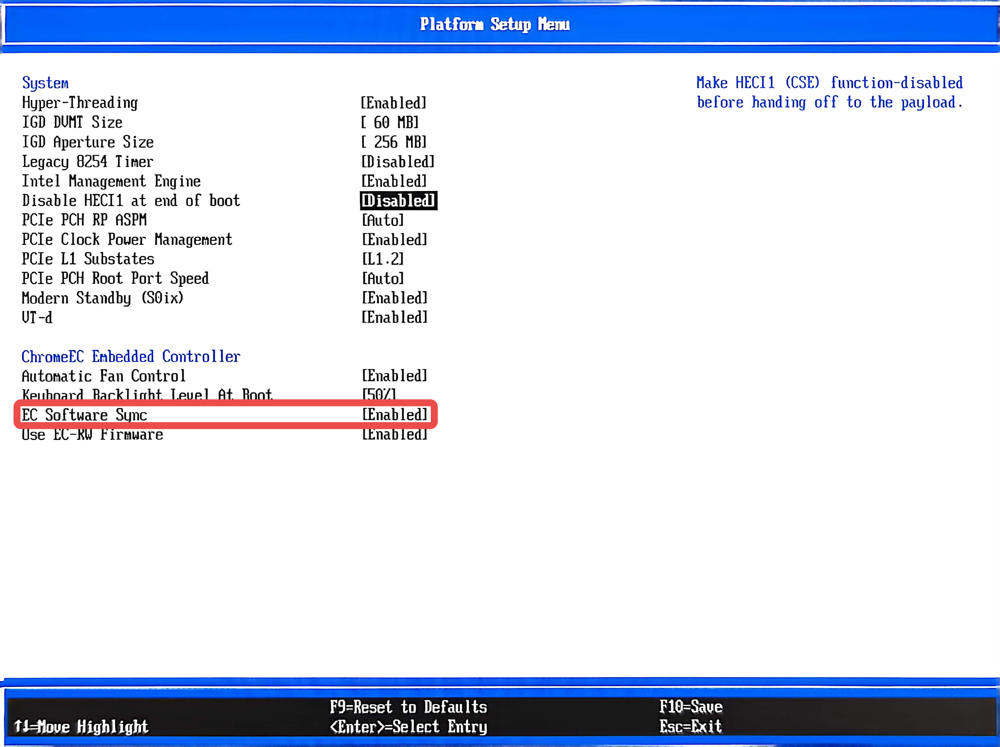

# Redrix EC 固件

为 HP Elite Dragonfly Chromebook (redrix) 定制的 Chromium OS Embedded Controller 固件。

## 硬件平台

- **设备**: HP Elite Dragonfly Chromebook (redrix)
- **EC 芯片**: Nuvoton NPCX9M3F
- **EC Flash**: 512KB（内部 flash，独立于主 BIOS 的 32MB SPI flash）

## EC Flash 布局与双固件机制

```
Offset        Size    Content
0x00000      256KB    RO 区域（硬件写保护，出厂锁定）
0x40000      256KB    RW 区域（可自由写入，日常运行）
```

EC 启动流程：

1. NPCX boot ROM 读取 flash 头部，将 RO 镜像从 flash 拷贝到 SRAM
2. EC 从 RO 启动
3. AP 发命令 `reboot_ec RW`，RO 调用 `download_from_flash()` ROM API
4. NPCX 将 RW 镜像从 flash 拷贝到 SRAM 并跳转执行（sysjump）

若 RW 损坏或校验失败，EC 回退到 RO 运行。RO 是出厂安全网，RW 是主力运行固件。

## EC 问题与修复

此分支基于主线 chrome-ec，针对 redrix 机型在非 ChromeOS 系统上的使用做了以下关键修复：

### 键盘背光在 sysjump 后失效

#### 现象

刷写 RW 固件后（`ectool reboot_ec RW` 或系统重启），键盘背光灯不亮：

```
$ sudo ectool pwmsetkblight 100
Keyboard backlight set.
$ sudo ectool pwmgetkblight
Keyboard backlight disabled.
```

`pwmsetkblight` 返回成功但硬件没有响应。

#### 原理

键盘背光灯驱动结构体 `kblight` 是一个静态全局变量（`common/keyboard_backlight.c`）：

```c
static struct kblight_conf kblight;  // BSS 段，初始时 kblight.drv = NULL
```

驱动注册函数 `keyboard_backlight_init()` 绑定在 `HOOK_CHIPSET_STARTUP` 上：

```c
DECLARE_HOOK(HOOK_CHIPSET_STARTUP, keyboard_backlight_init, HOOK_PRIO_DEFAULT);
```

`HOOK_CHIPSET_STARTUP` 只在 chipset 从 S5（关机）→ S4 → S3 转换时触发——这是 AP 冷启动的电源序列。Sysjump 后 chipset 已在 S0（运行态），该 hook 不会再触发。

时序如下：

```
RO 固件（出厂）
  冷启动 → G3→S5→S4→S3
    → HOOK_CHIPSET_STARTUP 触发
    → kblight_register() → kblight.drv 指向 PWM 驱动 ✅

  AP 启动 → ectool reboot_ec RW
    → sysjump 到 RW
───────────────────────────────────────────────────
RW 固件（新刷入）
  sysjump, BSS 清零 → kblight.drv = NULL
  chipset 已在 S0
    → HOOK_CHIPSET_STARTUP 不触发 ❌
    → kblight.drv = NULL 永久

  AP 发 pwmsetkblight 100:
    → kblight_set(100) → 变量设置成功 ✔
    → kblight_enable(1) → deferred call 调度 ✔
    → kblight_enable_deferred 执行:
      → if (!kblight.drv) return;  ← NULL, 静默跳过
    → PWM 硬件从未被操作 ❌
```

`kblight_set()` 和 `kblight_enable()` 仅设置内存变量和调度延迟调用，不做硬件操作。真正的 PWM 操作在 deferred function 中，但它检查 `kblight.drv` 是否为 NULL，为 NULL 则静默返回。因此 `ectool pwmsetkblight 100` 返回成功，但硬件从未被操作。

#### 修复

在 `common/keyboard_backlight.c` 中添加 sysjump 后的重新注册路径。新增函数注册在 `HOOK_INIT` 上（sysjump 时也会触发），通过 `system_jumped_to_this_image()` 判断是否为 sysjump 场景，仅重新设置 `kblight.drv`，不复位 PWM 硬件（硬件寄存器在软跳转中保留原有值）。

- **冷启动**: `HOOK_CHIPSET_STARTUP` → 正常初始化；`HOOK_INIT` 虽也触发但 sysjump 检查不通过，直接返回。
- **Sysjump**: `HOOK_CHIPSET_STARTUP` 不触发；`HOOK_INIT` → 重新注册驱动。

修复提交：`keyboard_backlight: re-register driver after sysjump`

### MKBP Host Event 事件传递（侧边音量按键无效）

#### 现象

侧边按键（音量+/音量-/电源）已在 Linux 输入子系统中注册：

```
$ evtest /dev/input/event7
Input device name: "cros_ec_buttons"
  Event code 114 (KEY_VOLUMEDOWN)
  Event code 115 (KEY_VOLUMEUP)
  Event code 116 (KEY_POWER)
```

但按下按键时 `evtest` 不产生任何事件。`ectool` 可正常通信（`ectool version`, `ectool flashread` 等均正常）。

#### 原理

MrChromebox coreboot 带了一个补丁：

```
3d45adc8616  ec/google/chromeec: drop SYNC IRQ for CREC device
```

它把 `CREC`（`GOOG0004`）的整个 `_CRS` 方法删掉了。于是 Linux 的
`cros_ec_lpc` 从 `platform_get_irq_optional()` 拿到 `-ENXIO`，永远不会调用
`devm_request_threaded_irq()`，结果 MKBP 事件（侧边音量键、电源键、各种 switch）
全都到不了 input 层。

硬件通路其实是好的：baseboard 已把 `GPP_F17` 配成 APIC 中断
（`PAD_CFG_GPI_APIC_LOCK(GPP_F17, NONE, LEVEL, INVERT, ...)`），接到 IOxAPIC
GSI `0x67`（`EC_SYNC_IRQ`）。缺的只是 ACPI 里对它的描述。

（键盘始终正常，是因为它走 8042 协议，不依赖 MKBP 中断。）

#### 修复

从内核侧恢复该中断，不改 coreboot、不改 EC 固件：

- Companion 仓库
  **[cros-ec-sync-irq-dkms](https://github.com/acd407/cros-ec-sync-irq-dkms)**：
  一个 DKMS 模块，用 `acpi_register_gsi()` 映射 GSI `0x67`，并把内核导出的
  `cros_ec_irq_thread()` 注册为 threaded handler —— 等价于 ACPI 资源存在时
  `cros_ec_register()` 自己会做的事。

模块加载后，MKBP 传递端到端可用，除桌面环境的常规按键绑定外无需任何用户态配置：

```
EC 拉低 GPIO_EC_PCH_INT_ODL → GPP_F17 → GSI 0x67 → IRQ (chromeos-ec)
  → cros_ec_irq_thread() → EC_CMD_GET_NEXT_EVENT
  → blocking_notifier_call_chain(event_notifier)
  → cros_ec_keyb_work() → KEY_VOLUMEUP/DOWN/POWER → input 子系统
```

#### 为什么撤销了先前的 EC 侧 workaround

在真正定位到根因之前，有两处 EC 侧改动试图绕开"未被注册的 GPIO 中断"，改走
eSPI SCI / host-event 通路来传递 MKBP 事件：

- `mkbp_event: send host event in S0 as fallback notification`
- `redrix/board: enable SCI delivery for MKBP host events`

这两处现在都已撤销，原因有二：

1. **已无必要。** 缺的从来不是 EC 的通知路径，而是 Linux 根本没注册 IRQ handler
   —— 因为 coreboot 删掉了 `CREC._CRS`。`cros-ec-sync-irq-dkms` 把正规的
   GPIO/APIC 中断恢复后，标准路径即可工作，SCI 兜底成了死代码。

2. **而且有害。** 在 S0 强发 `EC_HOST_EVENT_MKBP` 违背了上游守卫

   ```c
   if (active && chipset_in_state(CHIPSET_STATE_ANY_SUSPEND))
       host_set_single_event(EC_HOST_EVENT_MKBP);
   ```

   上游注释明确警告：在 S0 设置的 MKBP host event 可能残留，导致下一次 suspend
   时提前唤醒 AP。而 SCI mask 的改动只是为这条已不再使用的兜底路径服务。

撤销后 EC 固件行为与上游保持一致，也避免了 suspend/wake 回归。PD 那条
（`redrix/board: undef CONFIG_USB_PD_REQUIRE_AP_MODE_ENTRY`）与 MKBP 无关，保留。

提交：
- `Revert "mkbp_event: send host event in S0 as fallback notification"`
- `Revert "redrix/board: enable SCI delivery for MKBP host events"`

### USB PD AP Mode Entry（USB4 / 雷电自动协商）

#### 问题

`CONFIG_USB_PD_REQUIRE_AP_MODE_ENTRY` 启用时，EC 不主动进入任何 alt mode（DP/TBT/USB4），而是等待 AP 通过 host command（`ectool typeccontrol`）来指定要进入的模式。这是 ChromeOS 的标准行为——AP 端根据用户设置和显示器需求来决定是否进入 DP 或 USB4。

在非 ChromeOS 系统上，没有 AP 端来下发这些 host command，EC 会一直停在 USB3 模式，无法自动协商 USB4/Thunderbolt。

#### 修复

取消该配置项 (`redrix/board: undef CONFIG_USB_PD_REQUIRE_AP_MODE_ENTRY`)。之后 EC 不再等待 AP 指令，会自动进入端口双方都支持的最优模式（USB4 > TBT > DP）。

## 编译

需要 arm-none-eabi 交叉编译工具链。

```bash
make CROSS_COMPILE=arm-none-eabi- BOARD=redrix
```

编译产物：

| 文件 | 大小 | 说明 |
|---|---|---|
| `build/redrix/ec.bin` | 512KB | RO + RW 全量镜像 |
| `build/redrix/RO/ec.RO.flat` | ~252KB | 仅 RO 固件 |
| `build/redrix/RW/ec.RW.bin` | ~243KB | 仅 RW 固件（刷写用这个） |

### 添加自定义版本标记

编辑 `common/version.c` 中的 `build_info` 字符串，加入 `LOCAL_BUILD` 等自定义标记：

```c
const char build_info[] =
    VERSION " " CROS_FWID32 " " DATE " " BUILDER " LOCAL_BUILD";
```

重建后 `ectool version` 的 Build info 行会显示该标记，方便区分自定义固件与官方固件。

## 刷写 EC 固件

### 查看 Flash 信息

```bash
sudo ectool flashinfo
```

典型输出：
```
FlashSize 524288
WriteSize 1
EraseSize 65536
ProtectSize 65536
WriteIdealSize 240
Flags 0x0
```

Flash 总大小 512KB (524288 bytes)，其中 RO 占低 256KB，RW 占高 256KB。我们刷写的是 RW 区域。

### 安全刷写流程（仅刷 RW，不动 RO）

```bash
# 1. 备份当前 EC 全量固件
sudo ectool flashread 0 524288 ec_backup.bin

# 2. 擦除 RW 区域
sudo ectool flasherase 0x40000 262144

# 3. 刷入 RW 固件
sudo ectool flashwrite 0x40000 build/redrix/RW/ec.RW.bin

# 4. 重启 EC 到 RW（或全系统重启）
sudo ectool reboot_ec RW
```

### 验证刷写结果

```bash
# 回读验证
sudo ectool flashread 0x40000 262144 rw_readback.bin
sha256sum build/redrix/RW/ec.RW.bin rw_readback.bin

# 确认固件已运行
sudo ectool version
# Firmware copy: RW    ← 关键行
# Build info: ... LOCAL_BUILD  ← 自定义标记
```

## 禁止 EC 使用 BIOS 里面的 ECRW 固件

如果使用 [mrchromebox.tech](https://mrchromebox.tech/) 的 coreboot/edk2 固件替换了原厂 Chrome OS 固件（大家应该都是这样的），需要在 BIOS 中关闭 EC Software Sync，防止启动时 AP 固件自动覆盖 EC RW 分区。

### 操作步骤

1. 重启设备，按 `ESC` 进入 BIOS 设置界面
2. 找到 **EC Software Sync** 选项，关闭（Disable）它
3. 保存并退出



如果不关闭此选项，每次开机时 AP 固件会将其内嵌的 EC RW 镜像写入 EC，覆盖你刷写的自定义固件。

## 常见问题

### 刷完后 EC 回退到 RO

- 尝试全系统重启（`sudo reboot`），让 EC 经历完整电源序列
- 确保 RW 区域已先擦除再写入（`flasherase` + `flashwrite`）
- 若在非 ChromeOS SDK 环境中编译，fwid 显示 `CROS_FWID_MISSING` 是正常现象

### RO 区域保护

RO 区域有硬件写保护（由主板 GPIO 电平控制）。即使 flashwrite 从 offset 0 开始写，RO 区域也会被硬件拒绝，不会真正损坏。通常不需要修改 RO。

## 版本字符串

`ectool version` 输出示例：

```
RO version:    redrix_v2.0.26378-d5dba7885d
RO cros fwid:  redrix_14505.831.0
RW version:    redrix_v2.0.27860-0f0590ceec
RW cros fwid:  redrix_16238.2+tbt5
Firmware copy: RW
Build info:    ... DATE BUILDER [LOCAL_BUILD]
```

版本号由 `util/getversion.sh` 生成：`git describe` 找到最近的 tag，commit 数为从 tag 到 HEAD 的提交数，有未提交修改时追加 `+`（dirty 标记）。
